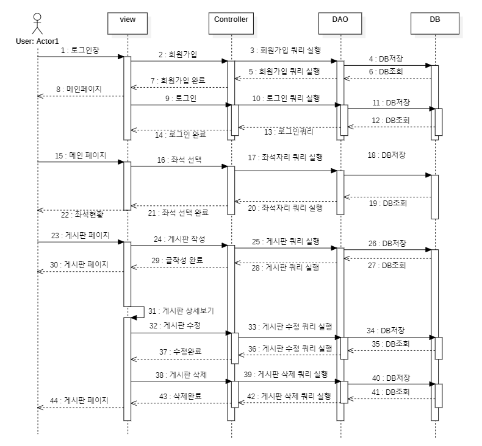

# StudtCafe

---

## 프로그램 내용

### 사용 언어 및 기술

---

1. 언어 / 프레임워크 : Java 11, JSP, Servlet, JS, CSS, Jquery
2. DB : mairadb
3. 개발툴 : 이클립스 jee,
4. DB관리툴 : heidisql

### 요구사항 명세 

### 다이어그램 

1. 유스케이스 다이어그렘 
   
2. ER 다이어그렘 
   
3. 시퀀스 다이어그렘 
   
4. 클래스 다이어그렘 
   

### 핵심 소스코드

1. list 불러오기 
   
2. 저장 
   
3. 읽기  
   
4. 삭제  
   

### 구현된 기능

---

1. 기본 CRUD(검색,추가,수정,삭제)
2. 좌석 선정
3. 로그인
4. 회원가입
5. 페이징 기능
6. 댓글 쓰기

### 추가로 개발했으면 하는 기능

---

1. 댓글에 댓글 기능을 작성하지 않음
2. ckeditor 사용하여 글작성하도록 하는것

### 피드백 내용

-지완 : 코드리뷰를 하지않아 소스를 파악하는데 늦어져 혼선이와 개선필요하며, 팀프로젝트를 하는데 머리로 생각한 내용을 다른사람에게 설명하지 않아 공유하지 않은 내용이 있어 다음 프로젝트에서는 공유를 해야될거 같습니다.

-성언 : 수업에서 배운 내용으로 프로젝트를 해보았는데 직접 코딩하는게 생각보다 어려워서 다양한 기능구현을 많이 못한거 같아서 아쉬웠지만 다른 팀원들의 도움을 받아서 몰랐던 점도 많이 알게 되어서 처음보다는 많이 성장하는 시간이 된 것 같다.

-예건 : 처음 프로젝트 진행 할때는 감을 못잡아 잘 몰랐지만 검색과 팀원들의 의견,피드백을 들으면서 CRUD기능에 대한 공부를 하였고, html과 css 지식이 얕은 관계로 UI디자인이 순조롭지 않았지만 팀원들의 도움을 받아 어느정도의 UI를 구성하게 된거 같습니다.
